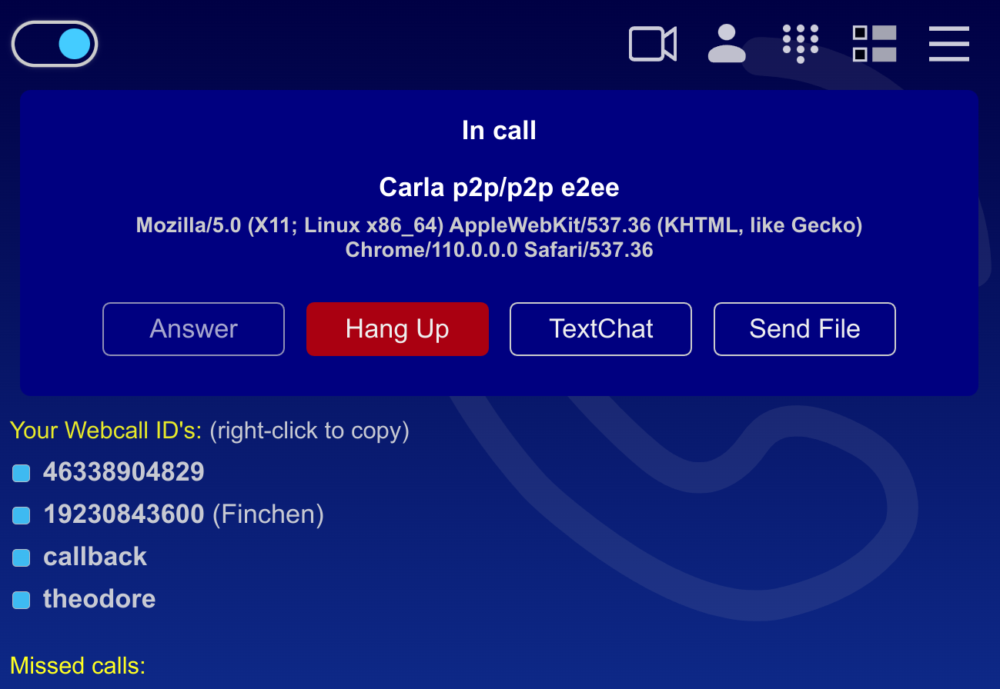

<div align="center">
  <a href="https://timur.mobi/webcall/android"></a>
</div>

# WebCall for Android

WebCall for Android is a P2P Telephony and Video-Telephony application based on WebRTC:

- Fully User-Defined IDs
- New Call Screen
- Waiting Callers + Handover
- Pickup, Reject, Hangup, Mute from Notification
- New Quick Setting Tile
- P2P TextChat
- P2P File Transfer
- Receive Calls 24/7
- Very High Audio Quality 300kbps in both directions
- Disconnect from Server while in P2P call
- Ultra Low Power Consumption
- Works well on Tablets

[](https://f-droid.org/packages/timur.webcall.callee/)

Or search for "webcall" inside the F-Droid app.

## Building the APK

Required: Java 11, Gradle 7.3.3, Android SDK

Create a local.properties file and make it point to your Android SDK:

```
sdk.dir=/home/username/bin/android-sdk...
```
Build the APK without signing it:

In build.gradle, outcomment the "signingConfig" lines:

```
android {
	buildTypes {
	    release {
	        minifyEnabled false
	        //signingConfig signingConfigs.release
	    }
	    debug {
	        minifyEnabled false
	        //signingConfig signingConfigs.debug
	    }
}
```

Run gradle build:

```
rm -rf build/outputs/apk && gradle build --info
```

You can now install the APK from build/outputs/apk/release/

Reproducible builds: https://timur.mobi/webcall/android/#reproducible


## License

This program is Free Software: You can use, study share and improve it at your will. Specifically you can redistribute and/or modify it under the terms of the GNU General Public License as published by the Free Software Foundation, either version 3 of the License, or (at your option) any later version.

GPL3.0 - see: [LICENSE](LICENSE)

### 3rd party code

- github.com/TooTallNate/Java-WebSocket, MIT license
- com.squareup.okhttp3, Apache License, Version 2.0

### 3rd party graphics, icons

- Uri Herrera, KDE Visual Design, GNU Lesser General Public
- Timothy Miller, Public domain
- BadPiggies, Creative Commons Attribution-Share Alike 4.0


